# GraphFrontier

GraphFrontier is **not** a plugin for Obsidian Graph View.
It is a fully independent plugin with its own physics engine, designed to implement ideas that are not possible in the standard graph plugin.

The main goal is to build an ideal, universal data-visualization tool that keeps the strengths of Graph View while removing its limitations.

It helps create a clean, well-organized structure for large collections of notes and stays very smooth even with a very large number of objects.

Especially useful for:

- Finding patterns
- Documentation
- Visualizing relationships in database structures
- Prompt engineering

## Support

This project is actively growing, and I would be very grateful for your support.

I would be happy to hear your ideas:

https://github.com/pikiby/GraphFrontier/discussions

And I would really appreciate your help with bug reports:

https://github.com/pikiby/GraphFrontier/issues

## Installation

Download:

https://github.com/pikiby/GraphFrontier/releases/download/0.6.7/graphfrontier-0.6.7.zip

1. Download `graphfrontier-0.6.7.zip` from Releases
2. Extract it into your vault plugins folder:
   - `<vault>/.obsidian/plugins/graphfrontier/`
3. In Obsidian enable the plugin:
   - `Settings -> Community plugins -> GraphFrontier -> Enable`

## Features

<table style="border-collapse: collapse; width: 100%;">
  <tr style="background-color: transparent;">
    <td width="50%" valign="top" align="left" style="background-color: transparent; border: none;">
      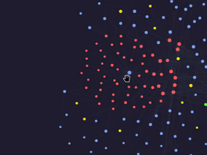
       
      
<strong>Pin nodes exactly where you want them</strong>

    </td>
    <td width="50%" valign="top" align="left" style="background-color: transparent; border: none;">
      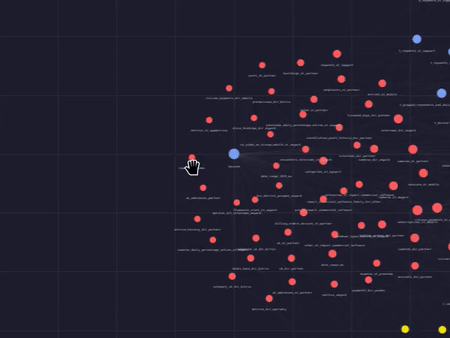
       
      
<strong>Pin nodes to the grid</strong>

    </td>
  </tr>
  <tr style="background-color: transparent;">
    <td width="50%" valign="top" align="left" style="background-color: transparent; border: none;">
      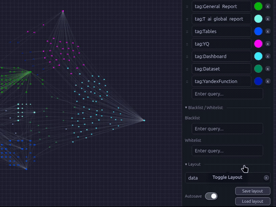
       
      
<strong>Save node positions and keep your layout exactly where you want it every time you open the graph</strong>

    </td>
    <td width="50%" valign="top" align="left" style="background-color: transparent; border: none;">
      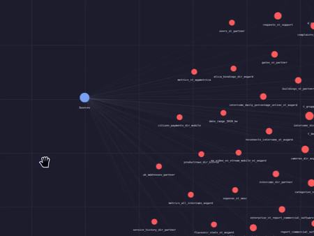
       
      
<strong>Boost attraction to a specific node</strong>

    </td>
  </tr>
  <tr style="background-color: transparent;">
    <td width="50%" valign="top" align="left" style="background-color: transparent; border: none;">
      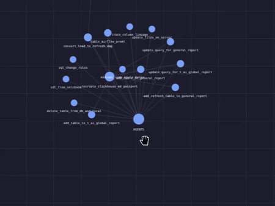
       
      
<strong>Place linked nodes on another node orbit with one click</strong>

    </td>
    <td width="50%" valign="top" align="left" style="background-color: transparent; border: none;">
      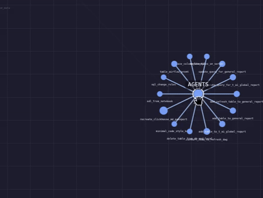
       
      
<strong>Move linked nodes and keep them exactly where you need them</strong>

    </td>
  </tr>
  <tr style="background-color: transparent;">
    <td width="50%" valign="top" align="left" style="background-color: transparent; border: none;">
      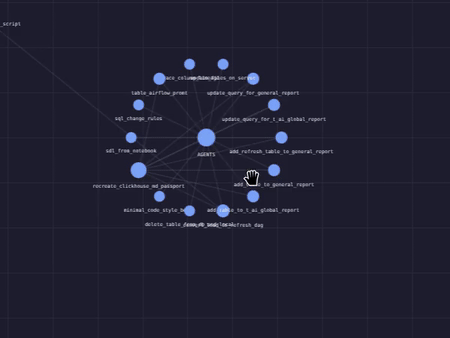
       
      
<strong>Paint links for better visual clarity</strong>

    </td>
    <td width="50%" valign="top" align="left" style="background-color: transparent; border: none;">
      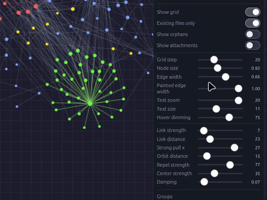
       
      
<strong>Hide links you do not need</strong>

    </td>
  </tr>
  <tr style="background-color: transparent;">
    <td width="50%" valign="top" align="left" style="background-color: transparent; border: none;">
      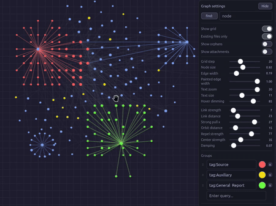
       
      
<strong>Find mode explore links in the full context</strong>

    </td>
    <td width="50%" valign="top" align="left" style="background-color: transparent; border: none;">
      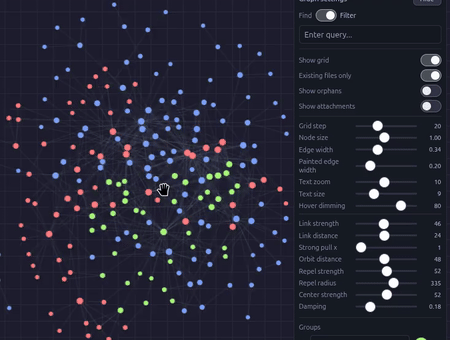
       
      
<strong>Filter mode local graph behavior directly in the global view</strong>

    </td>
  </tr>
  <tr style="background-color: transparent;">
    <td width="50%" valign="top" align="left" style="background-color: transparent; border: none;">
      
       
      
<strong>Orphan files stay separate from primary nodes</strong>

    </td>
    <td width="50%" valign="top" align="left" style="background-color: transparent; border: none;">
      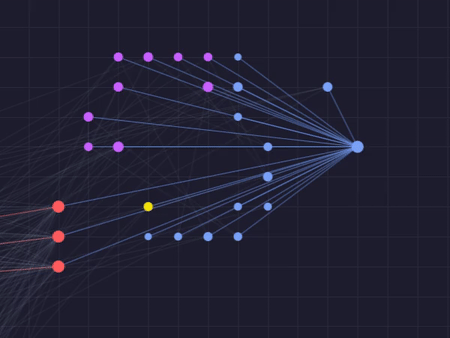
       
      
<strong>Show only linked attachments and place them directly on node orbits</strong>

    </td>
  </tr>
  
  <tr style="background-color: transparent;">
    <td width="50%" valign="top" align="left" style="background-color: transparent; border: none;">
      
       
      
<strong>Hotkey support</strong>

    </td>
    <td width="50%" valign="top" align="left" style="background-color: transparent; border: none;">
      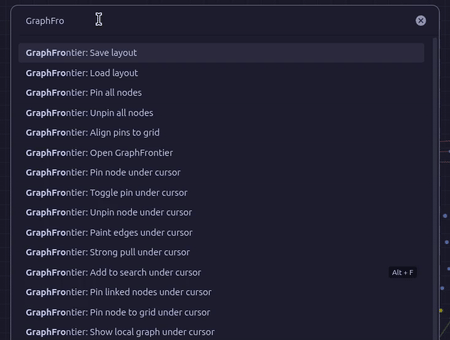
       
      
<strong>Command support</strong>

    </td>
  </tr>
  <tr style="background-color: transparent;">
    <td width="50%" valign="top" align="left" style="background-color: transparent; border: none;">
      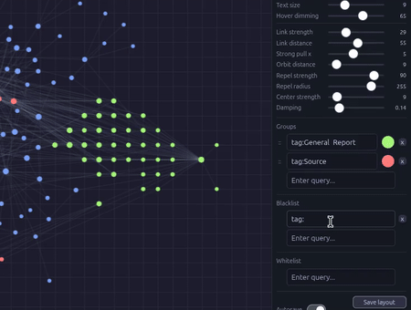
       
      
<strong>Hide unnecessary objects</strong>

    </td>
    <td width="50%" valign="top" align="left" style="background-color: transparent; border: none;">
      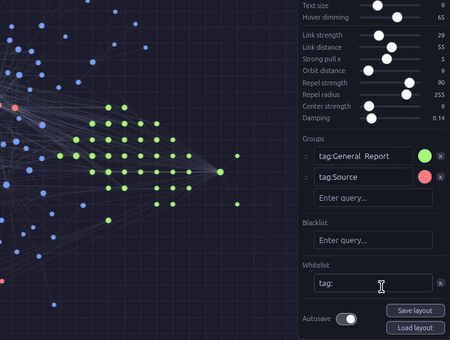
       
      
<strong>Keep only necessary objects</strong>

    </td>
  </tr>
</table>

## Documentation

- Installation: `docs/installation.md`
- Usage: `docs/usage.md`
- Settings: `docs/settings.md`
- Hotkeys and commands: `docs/hotkeys.md`
- Physics model: `docs/physics.md`
- Troubleshooting: `docs/troubleshooting.md`

## Project Structure

- `src/main.js`: plugin core, persistence, graph data collection, commands registration
- `src/view.js`: view lifecycle, UI, interactions, context actions, runtime orchestration
- `src/physics.js`: simulation and orbit-related calculations
- `src/render.js`: render pass, visual helpers, focus/label/color behavior
- `src/constants.js`: defaults, limits, command metadata, shared constants
- `src/static/`: plugin release assets source (`manifest.json`, `styles.css`, `versions.json`)
- `dist/`: release artifacts ready to install into a vault plugin folder

## License

MIT. See `LICENSE`.
